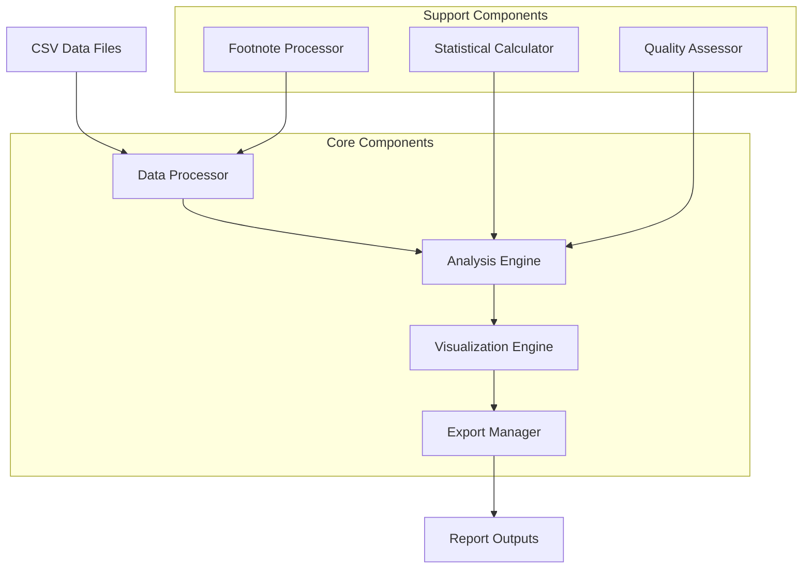

# Design Document

## Overview

The Occupation Data Reports application is a Python-based data science platform that processes the 2023 Occupational Requirements Survey (ORS) dataset to generate comprehensive analytical reports. The system will handle 148,600 occupational observations from 56,300 establishments, providing insights across 14 different report types for various stakeholder groups including workforce analysts, safety managers, HR professionals, and policy makers.

The application follows a modular architecture with separate components for data processing, analysis, visualization, and export functionality. It emphasizes data quality assessment, statistical rigor, and comprehensive footnote interpretation to ensure reliable insights from the BLS occupational survey data.

## Architecture

### High-Level Architecture



### Component Architecture

The system is organized into four main layers:

1. **Data Layer**: Handles CSV file ingestion, validation, and preprocessing
2. **Processing Layer**: Performs statistical analysis, correlation calculations, and data transformations
3. **Visualization Layer**: Creates charts, graphs, and interactive dashboards
4. **Export Layer**: Generates reports in multiple formats with proper formatting

## Components and Interfaces

### 1. Data Processor Component

**Purpose**: Handles all data ingestion, validation, cleaning, and preprocessing operations.

**Key Classes**:
- `CSVLoader`: Loads and validates the main dataset and metadata files
- `FootnoteProcessor`: Interprets footnote codes and applies data quality indicators
- `DataValidator`: Ensures data integrity and handles missing values
- `DataCleaner`: Standardizes occupation names and normalizes estimate values

**Interfaces**:
```python
class DataProcessor:
    def load_dataset(self, file_path: str) -> pd.DataFrame
    def load_footnotes(self, footnote_path: str) -> Dict[int, str]
    def validate_columns(self, df: pd.DataFrame) -> ValidationResult
    def process_footnotes(self, df: pd.DataFrame) -> pd.DataFrame
    def clean_occupation_names(self, df: pd.DataFrame) -> pd.DataFrame
    def handle_estimate_ranges(self, df: pd.DataFrame) -> pd.DataFrame
```

### 2. Analysis Engine Component

**Purpose**: Performs statistical calculations, correlations, and generates analytical insights.

**Key Classes**:
- `StatisticalAnalyzer`: Calculates confidence intervals, precision metrics, and reliability scores
- `CorrelationAnalyzer`: Performs cross-requirement correlation analysis
- `OccupationAnalyzer`: Groups and analyzes data by occupation categories
- `RequirementAnalyzer`: Analyzes specific requirement types and patterns

**Interfaces**:
```python
class AnalysisEngine:
    def calculate_confidence_intervals(self, estimates: pd.Series, std_errors: pd.Series) -> pd.DataFrame
    def analyze_occupation_distribution(self, df: pd.DataFrame) -> AnalysisResult
    def calculate_risk_scores(self, environmental_data: pd.DataFrame) -> pd.DataFrame
    def perform_correlation_analysis(self, df: pd.DataFrame) -> CorrelationMatrix
    def analyze_physical_demands(self, df: pd.DataFrame) -> PhysicalDemandsResult
    def assess_data_quality(self, df: pd.DataFrame) -> QualityAssessment
```

### 3. Visualization Engine Component

**Purpose**: Creates all charts, graphs, and visual representations of the data.

**Key Classes**:
- `ChartGenerator`: Creates standard charts (bar, pie, scatter, line)
- `HeatmapGenerator`: Generates heatmaps for correlation and risk analysis
- `DashboardBuilder`: Builds interactive dashboards with multiple visualizations
- `StatisticalPlotter`: Creates confidence interval plots and precision indicators

**Interfaces**:
```python
class VisualizationEngine:
    def create_distribution_chart(self, data: pd.DataFrame, chart_type: str) -> Figure
    def generate_heatmap(self, correlation_matrix: pd.DataFrame) -> Figure
    def create_confidence_interval_plot(self, data: pd.DataFrame) -> Figure
    def build_interactive_dashboard(self, report_data: Dict) -> Dashboard
    def create_risk_matrix(self, risk_data: pd.DataFrame) -> Figure
```

### 4. Export Manager Component

**Purpose**: Handles report generation and export in multiple formats.

**Key Classes**:
- `HTMLExporter`: Generates interactive HTML reports with embedded charts
- `PDFExporter`: Creates formatted PDF reports with static visualizations
- `CSVExporter`: Exports raw data and statistical summaries
- `ReportOrganizer`: Manages file structure and naming conventions

**Interfaces**:
```python
class ExportManager:
    def export_html_report(self, report_data: ReportData, output_path: str) -> bool
    def export_pdf_report(self, report_data: ReportData, output_path: str) -> bool
    def export_csv_data(self, data: pd.DataFrame, output_path: str) -> bool
    def create_master_dashboard(self, all_reports: List[ReportData]) -> str
    def organize_output_files(self, base_path: str) -> DirectoryStructure
```

## Data Models

### Core Data Structures

```python
@dataclass
class OccupationRecord:
    series_id: str
    series_title: str
    soc_code: str
    occupation: str
    requirement_type: str
    estimate_code: str
    estimate_text: str
    category_code: str
    category: str
    additive_code: str
    additive: str
    datatype_code: str
    datatype: str
    estimate: float
    standard_error: Optional[float]
    data_footnote: Optional[int]
    standard_error_footnote: Optional[int]
    series_footnote: Optional[int]

@dataclass
class FootnoteReference:
    code: int
    description: str
    precision_level: str
    interpretation_guidance: str

@dataclass
class AnalysisResult:
    occupation_category: str
    metric_name: str
    value: float
    confidence_interval: Tuple[float, float]
    reliability_score: float
    footnote_context: List[str]

@dataclass
class ReportData:
    title: str
    description: str
    analysis_results: List[AnalysisResult]
    visualizations: List[Figure]
    metadata: Dict[str, Any]
    generation_timestamp: datetime
```

### Database Schema (Optional SQLite for Caching)

```sql
-- Main occupational data table
CREATE TABLE occupation_data (
    id INTEGER PRIMARY KEY,
    series_id TEXT UNIQUE,
    soc_code TEXT,
    occupation TEXT,
    requirement_type TEXT,
    estimate REAL,
    standard_error REAL,
    data_footnote INTEGER,
    processed_timestamp DATETIME
);

-- Footnote reference table
CREATE TABLE footnotes (
    code INTEGER PRIMARY KEY,
    description TEXT,
    precision_category TEXT
);

-- Analysis results cache
CREATE TABLE analysis_cache (
    id INTEGER PRIMARY KEY,
    analysis_type TEXT,
    parameters_hash TEXT,
    result_data TEXT,
    created_timestamp DATETIME
);
```

## Error Handling

### Data Quality Issues

1. **Missing Estimates**: Handle records where estimate values are missing or marked with special footnotes
2. **Invalid SOC Codes**: Validate and flag occupation codes that don't match standard classifications
3. **Footnote Interpretation**: Properly handle range estimates (e.g., "less than 0.5%") and convert to numeric ranges
4. **Standard Error Validation**: Check for reasonable standard error values and flag outliers

### Processing Errors

```python
class DataProcessingError(Exception):
    """Raised when data processing encounters unrecoverable errors"""
    pass

class FootnoteInterpretationError(Exception):
    """Raised when footnote codes cannot be properly interpreted"""
    pass

class VisualizationError(Exception):
    """Raised when chart generation fails"""
    pass

class ExportError(Exception):
    """Raised when report export operations fail"""
    pass
```

### Error Recovery Strategies

- **Graceful Degradation**: Continue processing with warnings when non-critical data is missing
- **Fallback Visualizations**: Use simpler chart types when complex visualizations fail
- **Partial Report Generation**: Generate available sections even if some analyses fail
- **Detailed Logging**: Comprehensive logging for debugging and quality assurance

## Testing Strategy

### Unit Testing

- **Data Processing Tests**: Validate CSV loading, footnote interpretation, and data cleaning
- **Analysis Tests**: Test statistical calculations, correlation analysis, and confidence intervals
- **Visualization Tests**: Verify chart generation and data representation accuracy
- **Export Tests**: Ensure proper formatting and completeness of exported reports

### Integration Testing

- **End-to-End Workflows**: Test complete report generation pipelines
- **Data Pipeline Tests**: Validate data flow from CSV input to final report output
- **Cross-Component Tests**: Ensure proper communication between analysis and visualization components

### Data Quality Testing

- **Footnote Accuracy**: Verify correct interpretation of all 36 footnote codes
- **Statistical Validity**: Validate confidence interval calculations and precision metrics
- **Correlation Accuracy**: Test correlation calculations against known statistical methods
- **Sample Representativeness**: Verify proper handling of the 145,866,200 civilian worker population

### Performance Testing

- **Large Dataset Handling**: Test with full 148,600 observation dataset
- **Memory Usage**: Monitor memory consumption during processing and visualization
- **Export Performance**: Measure time to generate reports in different formats
- **Concurrent Processing**: Test multiple report generation scenarios

## Implementation Considerations

### Technology Stack

- **Core Framework**: Python 3.9+ with pandas for data manipulation
- **Statistical Analysis**: NumPy, SciPy for statistical calculations
- **Visualization**: Plotly for interactive charts, Matplotlib for static visualizations
- **Export Formats**: WeasyPrint for PDF generation, Jinja2 for HTML templating
- **Data Validation**: Pydantic for data model validation
- **Testing**: pytest for unit and integration testing

### Performance Optimizations

- **Data Caching**: Cache processed data and analysis results to avoid recomputation
- **Lazy Loading**: Load data on-demand for specific report types
- **Parallel Processing**: Use multiprocessing for independent analysis tasks
- **Memory Management**: Implement data chunking for large dataset operations

### Scalability Considerations

- **Modular Design**: Easy to add new report types and analysis methods
- **Configuration-Driven**: Use configuration files for report specifications
- **Plugin Architecture**: Support for custom analysis modules
- **API-Ready**: Design components to support future web API development

### Security and Privacy

- **Data Sanitization**: Ensure no sensitive information in exported reports
- **File Path Validation**: Prevent directory traversal attacks in export operations
- **Input Validation**: Validate all user inputs and configuration parameters
- **Audit Logging**: Track all data processing and export operations